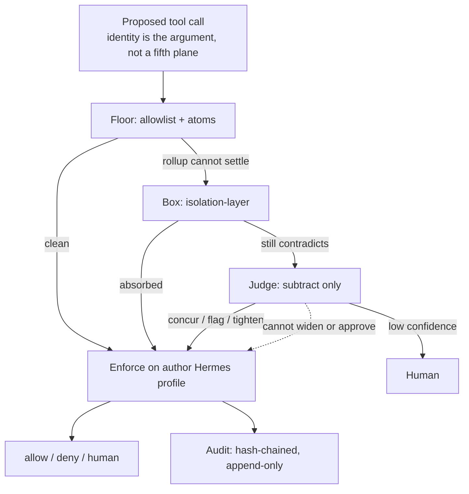

# capability-gate

A deny-by-default capability gate sits on the Hermes `pre_tool_call` hook and answers allow, deny, or ask before a tool runs. An agent thinks in text, and every real consequence is a tool call; in most setups that line is unbroken, because the model decides to read, write, or run, and the runtime obeys. This repository closes that line: the agent does not run the tool, it asks the gate, and the model proposes while the gate disposes.

## Why

An agent wired into real systems is a non-human identity with standing access. It holds the tools and paths its task needs, and usually far more, because permissions are granted broad and rarely pulled back. A prompt injection, a poisoned document, or a confused plan then acts with everything that identity can reach, not just what the task required. Most controls watch for that after the fact and alert on it. This one enforces least privilege at the point of action. A call outside what the skill was granted does not run.

The decision is deterministic code you can read, not the probabilistic model you cannot fully trust, because the model is the thing being guarded against. If the guard were also the model, a clever prompt could talk it into opening the door. A small amount of deterministic code cannot be argued with. Safety becomes a property of what a skill can reach, not of what the model can be talked into.

## What it does

The gate sits on the Hermes `pre_tool_call` hook and enforces one file: an allowlist. Each skill may touch only the tools and paths its entry grants. Everything else is denied.

- **Deny by default.** An unlisted skill, tool, or path is denied.
- **Mediation at the hook.** While the plugin is loaded, every call that reaches `pre_tool_call` is checked, and every path that call touches is checked with it. That is completeness on one path, not a reference monitor over the agent's whole lifetime. A plugin that is not loaded mediates nothing, and this gate cannot prove its own presence.
- **Least privilege.** A skill does only what its entry grants.
- **Fail closed.** Any error in the decision path is a denial. The Hermes hook framework catches hook errors and lets the agent continue, so it fails open. A gate cannot lean on the thing it guards. It stops itself.
- **Fail loud.** A policy that cannot resolve, an unset path variable, a malformed grant, is rejected at load, not silently ignored at decision time where the failure would be a security gap.
- **Log before act.** The decision is flushed to durable storage before it returns, so the record survives a crash mid-action and the audit trail is real from the first call.

## Rollout

Two modes make rollout safe. Observe decides and logs exactly as it would, and blocks nothing. Enforce acts on the decision. The intended rollout is observe first: run observe, read the log, write the grants to match what the agent actually does, adjudicate would-denies, then flip to enforce. `report.py` reads the decision log and surfaces the grant gap, the tools and paths used but not yet granted, so the enforce allowlist is distilled from real behavior instead of guessed. Observe protects nothing by design. Protection is an enforce-mode property.

The allowlist is not frozen at the flip. After enforce, grants can keep training from live behavior under the same deny-by-default rule.

## Install

    # from your Hermes plugins directory
    git clone https://github.com/Steck43/capability-gate.git ~/.hermes/plugins/capability-gate
    cd ~/.hermes/plugins/capability-gate
    cp allowlist.example.yaml allowlist.yaml   # then edit allowlist.yaml for your skills
    python -m pytest -q                         # confirm the decider passes

Enable the plugin under `plugins.enabled` in your Hermes `config.yaml`. Start in observe, read `~/.hermes/logs/capability-gate.jsonl`, tune the allowlist, then set the mode to enforce.

## Status

Honest about what runs versus what is planned.

- **Working, tested.** Stage 1, the decider: deny-by-default allowlist enforcement over tool and path, fail-closed, fail-loud on unresolved policy, log-before-act, observe and enforce modes. The decision core is runtime-agnostic and covered by tests. Fresh clone: `python -m pytest -q` passes (Hermes adapter tests skip without Hermes).
- **Live.** On a Hermes profile this gate is configured in **enforce**. The chain to get there is documented: observe first, then a would-deny review, then adjudication, then the flip, with a named rollback path. The observe study covered the calls the gate saw across a one-month window, which was a small fraction of that agent's total tool traffic in the period, because the plugin was not resident throughout. The allowlist was distilled from what it did see, and it continued to train after the flip. Enforce does not mean a frozen grant set.
- **Known limits (written up in the repo).** Path matching is lexical, `normpath` after expand. Symlink resolution is not on the decide path, so a symlink to an off-allowlist target is not caught today. Case `S1` is that hole in the table: an in-grant symlink to an off-grant `.ssh`-shaped target is deny-ground-truth and the gate ALLOWs (FALSE-ALLOW). The CG Stage-1 lab lives in this roof (`harness/lab_insufficiency_harness.py`, `harness/evidence_receipt.json`). `tests/test_harness_tally.py` asserts nineteen cases by id against `capability_gate.py`, counts derived from the harness sets: 15 deny-expected, 7 CAUGHT-NAIVE, 8 FALSE-ALLOW, 4 CORRECT-ALLOW, 0 FALSE-DENY. The eight that get through are not all composition: context-blindness, argument-level intent, and lexical symlink matching appear as well. One of the seven CAUGHT denials is an `ask` mapped to Stage-1 block semantics rather than a hard deny. C1 and R1 remain `..` lexical catches; they are not S1. Reproduce: [REPRODUCE.md](REPRODUCE.md). The Zenodo record `plugin-v0.1.0` (`10.5281/zenodo.22018053`) predates this kit; the concept DOI `10.5281/zenodo.22018052` resolves to the latest release.
- **This repository is one layer.** Sibling work: [aegis-atoms](https://github.com/Steck43/aegis-atoms), [isolation-layer](https://github.com/Steck43/isolation-layer), [owasp-dual-top10-lab](https://github.com/Steck43/owasp-dual-top10-lab). Author: [Landen Stecker](https://github.com/Steck43). This gate does not consume them.

## Four-plane path

This roof is the allowlist floor. Sibling roofs hold the atom plane, the box, and the judge. The ordering is design intent, not a forced invoke from `evaluate`. `always_invoked` stays false.

This is a capability gate for one agent, not an operating system. The isolation idea it is built on is the same one that runs underneath every OS: let untrusted programs run on a machine without letting them wreck it or each other. Capability is what the model has. Freedom is what the system permits. Containment is the precondition for scale: more floor, more freedom, less residual risk. Authority only narrows down the tree. Kubernetes is not the scale story.

The Stage-1 table is `Gate.evaluate` on named skills. The live Hermes hook resolves skill as `*` (`harness/d15_hermes_faithful.py`). That transfer is NON-TRANSFER; do not read the lab table as "the gate does." After an S1 ALLOW, reopen by the name Hermes was given still ALLOWs (`tests/test_s1_distinguish.py`). Realpath is not the written-up remedy. Alias ids S2–S5 (hardlink, junction, `/proc/self/root`, bind-mount) are a separate class; they do not ride on S1.

## Requirements

- The decider (`capability_gate.py`) has zero third-party dependencies. Standard library only, by design, so the decision logic is testable without any runtime.
- Tooling and tests require the packages in `requirements-dev.txt` (PyYAML for policy loading and reporting, pytest for the suite).
- The Hermes adapter and its tests require a Hermes install. On a standalone clone those tests skip.
- Tested on Python 3.12.

To run the tests:

    python3 -m venv .venv && . .venv/bin/activate
    pip install -r requirements-dev.txt
    pytest -q

## License

MIT. See LICENSE.
